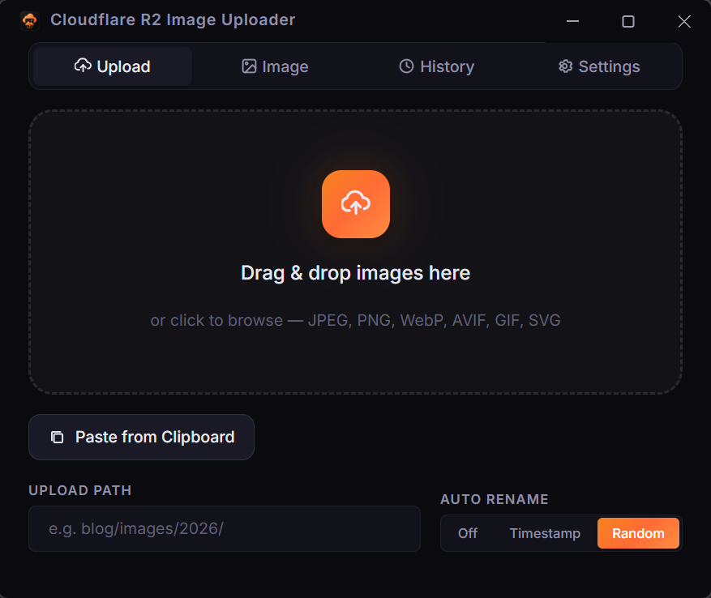

<p align="center">
  
</p>

<h1 align="center">Cloudflare R2 Image Uploader</h1>

<p align="center">
  A <strong>privacy-first</strong>, <strong>minimalist</strong> desktop application for uploading images to Cloudflare R2 storage — with <strong>built-in compression and resize</strong>, so every image is optimized before it ever leaves your machine.
</p>

<p align="center">
  Drag, drop, compress, get URL. One app handles everything — no external tools, no online services, no extra steps. Designed for bloggers, developers, and content creators who want fast, optimized image hosting on Cloudflare R2 with zero friction.
</p>

<p align="left">
  <a href="README.zhtw.md">中文</a>
</p>

<p align="center">
  
</p>

## Key Features

- **Image-Only Upload** — Focused on images (JPEG, PNG, WebP, AVIF, GIF, SVG, and more)
- **Drag & Drop** — Drop images directly onto the app for instant upload
- **Paste from Clipboard** — One-click paste of screenshots or copied images
- **Built-in Compression** — Quality-based compression powered by sharp — optimize images in one step, no external tools needed
- **Built-in Resize** — Percentage-based scaling with quick presets (25%, 50%, 75%, 100%)
- **Pre-Upload Preview** — See estimated compressed size and savings before uploading
- **Auto-Confirm** — Optionally skip the confirmation dialog for a fully automatic workflow
- **Auto Clipboard** — Copy the upload URL automatically (Raw / Markdown / HTML formats)
- **Auto Rename** — Rename to timestamp or random ID to avoid filename collisions
- **Credential Profiles** — Save and switch between multiple R2 connection configs
- **Upload History** — Browse and re-copy past upload URLs
- **Light / Dark Mode** — Switch themes from Settings
- **Export / Import** — Back up and restore all settings and history as JSON
- **Cross-platform** — Windows, macOS, and Linux

## Quick Start

```bash
# Install dependencies
npm install

# Run in development mode
npm run dev

# Build for production
npm run build:win    # Windows
npm run build:mac    # macOS
npm run build:linux  # Linux
```

## Configuration

1. Launch the app and go to the **Settings** tab
2. Fill in your Cloudflare R2 credentials:
   - **S3 API Endpoint**: `https://<account-id>.r2.cloudflarestorage.com`
   - **Access Key ID** and **Secret Access Key**: Generate from Cloudflare Dashboard → R2 → Manage R2 API Tokens
   - **Bucket Name**: Your R2 bucket name
   - **Public URL Base**: Your custom domain (e.g., `https://images.yourdomain.com`)
3. Click **Test Connection** to verify
4. Switch to the **Upload** tab and start uploading!

## Image Processing

Go to the **Image** tab to configure processing options:

- **Compression** — Adjust quality (1-100%) to reduce file size while preserving visual fidelity
- **Resize** — Scale images by percentage before uploading
- **Both** — Apply compression and resize together for maximum size reduction
- **Auto-confirm** — Skip the preview dialog and upload processed images directly

Processing is **off by default** — enable it only when you need it.

## Design Philosophy

- **Image-first** — Purpose-built for the image upload workflow
- **Privacy & Security** — Credentials never leave your machine; all sensitive fields masked by default
- **Minimalist** — No bloat, no accounts, no telemetry — just a fast image uploader

## Tech Stack

- **Electron** + **electron-vite** — Desktop framework
- **React 18** + **TypeScript** — UI
- **sharp** — High-performance image compression and resize (libvips)
- **AWS SDK v3** (`@aws-sdk/client-s3`) — S3-compatible R2 uploads
- **electron-store** — Persistent local config (config + history as separate files)

## License

MIT
